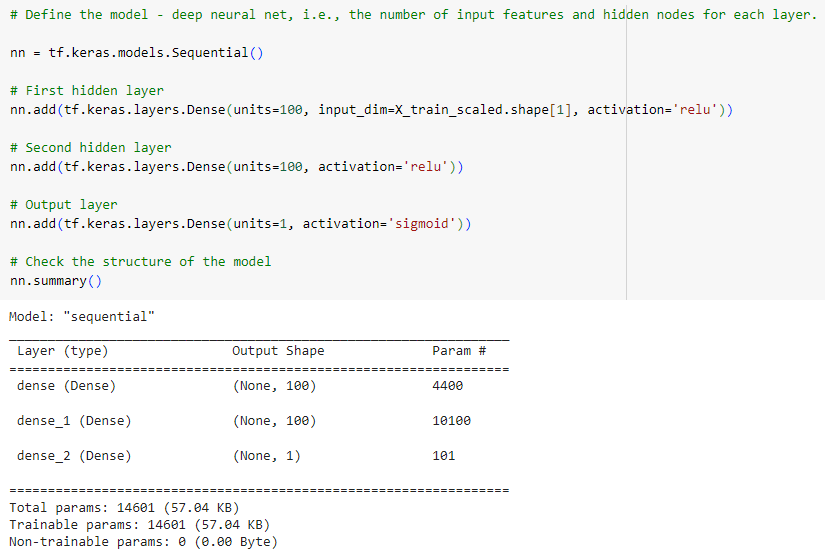

## Deep Learning Challenge

## Alphabet Soup Funding

# Purpose
The nonprofit foundation Alphabet Soup wants a tool that can help it select the applicants for funding with the best chance of success in their ventures. With machine learning and neural networks, I’ll use the features in the provided dataset to create a binary classifier that can predict whether applicants will be successful if funded by Alphabet Soup.

# Data Preprocessing
 - What variable(s) are the target(s) for your model?
    - The target for each model was the IS_SUCCESSFUL column. The goal is to predict which applicants will have best chance of success in their ventures.
 - What variable(s) are the features for your model?
    - The available features for my model are: APPLICATION_TYPE, AFFILIATION, CLASSIFICATION, USE_CASE, ORGANIZATION, STATUS, INCOME_AMT, SPECIAL_CONSIDERATIONS, and ASK_AMT
 - What variable(s) should be removed from the input data because they are neither targets nor features?
    - I removed EIN and NAME as they are neither features or targets.

# Compiling, Training, and Evaluating the Model
 - How many neurons, layers, and activation functions did you select for your neural network model, and why?
    - For the first model I used two hidden layers with 100 neurons each. ReLU activation functions are used in the hidden layers to introduce non-linearity and allow the model to learn complex relationships in the data. The Sigmoid activation is used in the output layer binary classification to output probabilities.
    

 - Were you able to achieve the target model performance?
    - I was not successful
 - What steps did you take in your attempts to increase model performance?

# Summary
Overall, the deep learning model provides a promising approach for predicting charity donations based on individual characteristics. However, if the target model performance is not achieved with the current approach, we might recommend exploring other machine learning algorithms such as Random Forests, Gradient Boosting Machines, or Support Vector Machines. These algorithms are known for their effectiveness in classification tasks and may provide better performance for this particular problem. Additionally, ensemble methods combining multiple models could also be explored to further improve prediction accuracy.

# Project Instructions
Step 1: Preprocess the Data
- Using your knowledge of Pandas and scikit-learn’s StandardScaler(), you’ll need to preprocess the dataset. This step prepares you for Step 2, where you'll compile, train, and evaluate the neural network model.

- Start by uploading the starter file to Google Colab, then using the information we provided in the Challenge files, follow the instructions to complete the preprocessing steps.
    - Read in the charity_data.csv to a Pandas DataFrame, and be sure to identify the following in your dataset:
        - What variable(s) are the target(s) for your model?
        - What variable(s) are the feature(s) for your model?
    - Drop the EIN and NAME columns.
    - Determine the number of unique values for each column.
    - For columns that have more than 10 unique values, determine the number of data points for each unique value.
    - Use the number of data points for each unique value to pick a cutoff point to bin "rare" categorical variables together in a new value, Other, and then check if the binning was successful.
    - Use pd.get_dummies() to encode categorical variables.
    - Split the preprocessed data into a features array, X, and a target array, y. Use these arrays and the train_test_split function to split the data into training and testing datasets.
    - Scale the training and testing features datasets by creating a StandardScaler instance, fitting it to the training data, then using the transform function.

Step 2: Compile, Train, and Evaluate the Model
Using your knowledge of TensorFlow, you’ll design a neural network, or deep learning model, to create a binary classification model that can predict if an Alphabet Soup-funded organization will be successful based on the features in the dataset. You’ll need to think about how many inputs there are before determining the number of neurons and layers in your model. Once you’ve completed that step, you’ll compile, train, and evaluate your binary classification model to calculate the model’s loss and accuracy.

    - Continue using the file in Google Colab in which you performed the preprocessing steps from Step 1.
    - Create a neural network model by assigning the number of input features and nodes for each layer using TensorFlow and Keras.
    - Create the first hidden layer and choose an appropriate activation function.
    - If necessary, add a second hidden layer with an appropriate activation function.
    - Create an output layer with an appropriate activation function.
    - Check the structure of the model.
    - Compile and train the model.
    - Create a callback that saves the model's weights every five epochs.
    - Evaluate the model using the test data to determine the loss and accuracy.
    - Save and export your results to an HDF5 file. Name the file AlphabetSoupCharity.h5.
